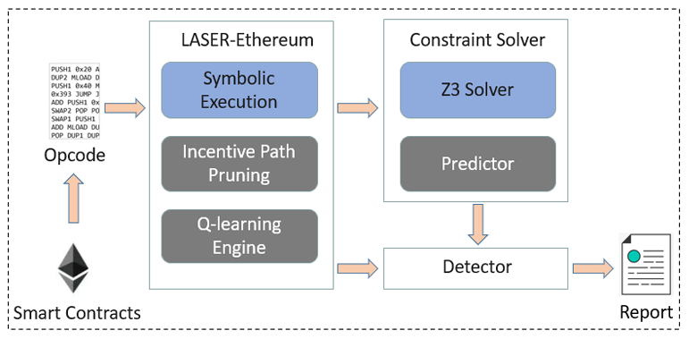

# MythrilQL

结合强化学习和符号执行的智能合约漏洞检测工具，在EVM 字节码的安全分析工具[Mythril](https://github.com/Consensys/mythril)基础上实现

论文**Reinforcement Learning Guided Symbolic Execution for Ethereum Smart Contracts**发表于会议[APSEC2023](https://conf.researchr.org/home/apsec-2023)

## 简介

使用符号执行技术来检测智能合约中的漏洞通常会面临以下三个问题：

+ **路径爆炸**
+  **约束求解困难**
+ **搜索策略简单**

本项目为了缓解这些问题，提出了三个方法：

+ **强化学习引导的搜索策略**
+ **基于路径上敏感指令和路径深度的激励式路径剪枝策略**
+ **通过预测求解时间来决定是否求解某个约束**

## 总体架构

